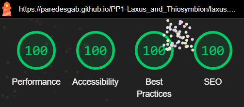
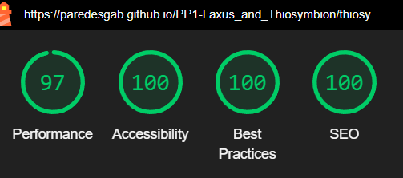
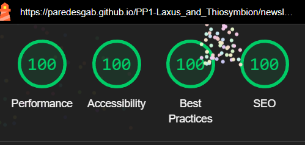
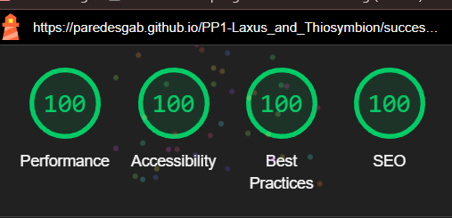

# Laxus and Thiosymbion

(Developer: Gabriela Fabiola Paredes Rojas)

Symbiosis is defined as "the living together of differently named organisms" (de Bary, 1879). This website provides information on an extraordinary symbiotic example, the one involving the free-living marine nematode *Laxus oneistus* and its inseparable bacterial partner, *Candidatus* Thiosymbion oneisti. 

+ Throughout this documentation, they will be referred as *Laxus* and Thiosymbion. respectively.

+ The site can be accessed via this [link](https://paredesgab.github.io/PP1-project-portfolio-1/)

## Project Goals

### User Goals

+ Find clear, fun and engaging information about this marine symbiosis.
+ Understand or learn about the unique relationship between *Laxus* and Thiosymbion. 
+ Explore the "cool factor" of symbiosis through this example.
+ Leave with a new appreciation for the surprising, complex relationships that exist even in the smallest corners of the ocean.

### Business Owner Goals

+ My primary goal is **science communication**. Namely:

  + Inform, raise awareness and public outreach about the existance of this fascinating but little-known nematode-bacterium symbiosis.  
  + Communicate key scientific findings of the *Laxus*-Thiosymbion partnership in a simple way.

+ In addition:
  + Spark interest in further scientific study of this fascinating symbiotic system. 
  + Generate public engagement to build a network of people excited about marine symbioses.

## User Experience

### Target audience

+ General public interested in life, nature or biology.
+ Environmental advocates, because global warming and/or human impact have also an effect on marine meiofauna.
+ Students, teachers or marine science enthusiasts studying marine biology, ecology, nematology, or microbiology. 
+ Researchers, scientists.

### User expectations

+ Accessible site.
+ Fast access to content.
+ Understand clearly the purpose of the site.
+ Have relevant content that keeps the user engaged.
+ Easy and intuitive navigation, overall a smooth experience.
+ Mobile-friendly, but generally a responsive design that works well on all devices.

### User stories

+ **As a first-time user, I want to:**

  + Easily navigate the website and find the content interesting.
  + Be surprised to discover that drastically different organisms in nature might depend on each other for survival.
  + Find this, otherwise niche topic, entertaining and easy to understand. 
  + Find useful information about this symbiosis, so I can compare it with my research system. 
  + Visit the social media platforms to see what activity is going on around this topic.

+ **As a returning user, I want to:**

  + Discover the latest key findings or new research on the *Laxus*-Thiosymbion symbiosis. 
  + Connect with scientists working on marine symbiosis, so they can share their insights in schools, museums, or to establish a scientific collaboration.
  + See if other symbiotic systems are featured on the site.

+ **As the business ownser user, I want:**

  + Pass on my love for this system that was my workhorse for many years. 
  + Highlight the key discoveries I made during my Ph.D. research (Paredes et al., 2021, 2022).
  + Keep the website updated with the latest research on this symbiosis. 
  + Know if the visitors found the content interesting and if it was easy to understand. 
  + Know what other symbiosis-related content my users want to see. For example, testimonial from scientists, or the process of collecting the nematodes from sand, etc. 

## Features 

### Navigation Bar

  + It is positioned at the top of the page, and it is found across all pages of the website. 
  + It is clear and easy to navigate.
  + On the left, it contains the "Laxus & Thiosymbion" logo.
  + On the right, it contains the following four navigation links:

    + **HOME:** Takes you to the home page where users can learn about the *Laxus*-Thiosymbion symbiosis.

    + **LAXUS:** Takes you to the page that features the nematode *Laxus oneistus* and what it might be providing to its bacterial partner.

    + **THIOSYMBION:** Takes you to the page describing the bacterium *Candidatus* Thiosymbion oneisti and what it might provide to its nematode host.

    + **NEWSLETTER:** Takes you to the contact form to subscribe to our newsletter with symbiosis stories.

  + All four navigation links have a hover effect. Namely, an underline to indicate in which page the user is on, and a hover highlight for 992px and up devices, to indicate that they are clickable.

  + In addition, the navigation bar is responsive:

    + **On mobile devices:**
        
      + The navbar features the logo on the left, with a hamburger menu from Font Awesome on the right.

    

      + When clicked, the hamburger menu reveals a drop-down with the navigation links displayed (in the same order as described above), and they have an image of *Laxus* as bullet points.

    

    + **On tablets and larger screens** 
      + The logo remains on the left, the hamburger disappears and instead you see all the navigation links spaceously distributed on the right.

    
       
---
### HOME page

  * It presents the symbiosis of *Laxus* and Thiosymbion.
  * It intends to make the topic of symbiosis easy to understand, by:
    * Presenting it as a love story - it is after all, a relationship.
    * Using the analogy of wearing a winter coat, so to make it clearer that the bacteria live on the surface. 
  * It highlights the extraordinary features of this partnership, including fun facts to make the content more interactive.
  * It also introduces the social media channels.
  * The home page is responsive.

  

#### Hero section

- The hero section is placed on the top of the home page below the navbar.
- The intention is to make it simple yet impactful - here, the black background allows the single nematode picture to shine.
 - The title of the website (h2) "A extraordinary symbiosis" is next to the image and it has a yelloish/white color, same as the bacterials symbiont.  
 - The background image and the title position and font-size are responsive across all devices. 

#### Love story section

- This section aims to introduce the symbiosis in a fun and simplified way.
  
- It contains: a title (h3), an intro text explaining the website's theme, a video of moving worms, and a video caption. 

- The "love story" title is an analogy representing symbiosis as a partnership.

- The text is written to engage all audiences, for example, using the analogy of a winter coat in Caribbean heat to help users imagine life as this nematode.  

- The video, shows several *Laxus oneistus* in motion, and the caption, highlights their resemblance with rice noodles but, in fact, the whiteness comes from the bacteria on the surface. 

- This section is responsive, and from Tablets up flex box with flex direction row was used. 
    

#### Extraordinary section

- As the title suggests, this section aims to highlight extraordinary features of this symbiosis. 
    
- Three key features have been selected and displayed using the HTML class attribute: feature1.
    
- They allow the user to learn about the habitat, reasons of being together and more importantly, the uniqueness of this symbiosis, 

- To make it more interactive, each feature card has a "fun fact" that is highlighted in bold and next to a star from Font Awesome.

- Two publications are referenced and linked. 

- These features are in fact seminal findings of the *Laxus*-Thiosymbion research. As such, they will likely remain as the site is updated, but more features will be added as new research emerges.

- This section was made responsive. Namely:
  - The title (h3) increases in font size.
  - In mobiles: the figure is placed on top of the text, forming a column. 
  - In tablets, the figure and text were placed next to each other(in a row). This was achieved because their container (class feature1) was set to display property: flex.
  - In Laptops and Up, this display propery was set to column, to have the features next to each other. 
​

#### Footer

- The footer section is found across all pages from the website.
- The footer section contains links to the relevant social media sites that feature *Laxus* and Thiosymbion.
- The links will open to a new tab to allow easy navigation for the user. 
- The footer adds value by encouraging users to stay connected through social media.
- The footer has a hover effect, and is responsive, with increasing font sizing and padding as the screen width increases.
​

---
### LAXUS page

- This page provides the user with more information about the nematode.

- It contains three sections, from top to bottom:

  - The **Hero Laxus section**: it uses the same style as the hero section from the home page. This section is responsive, and its height increases as the device screen width increases. 

  - The **Laxus introduction section**: it uses the same style as the love story section from the home page. This section is responsive.

  - The **What Laxus gives to Thiosymbion section**: it is a research study conducted by the developer in 2022. A summary of the main findings of the article is presented, as well as a nutritional model of the interaction of *Laxus* with its bacteria. The study is also linked to the website, and this section is responsive.  

  

---
### THIOSYMBION page

- This page provides the user with more information about the bacteria.

- Intentionally, for consistency, it has the same style and responsiveness as the Laxus page. Thus, from top to bottom:

  - The **Hero Thiosymbion section**.

  - The **Thiosymbion introduction section**.

  - The **What Thiosymbion gives to Laxus section**: it is a research study conducted by the developer in 2021. A summary of the main findings of the article is presented, as well as a nutritional model of the interaction of Thiosymbion with the nematode. The study is also linked to the website, and this section is responsive.  

  

---
### NEWSLETTER page

  - This page will allow the user to subscribe to our newsletter, to stay updated on new content, discoveries, or tips related to the *Laxus*-Thiosymbion symbiosis or other "love stories".

  - To subscribe to the newsletter, the user is required to provide their name, email address, feedback,  choose which system is of their interest, and click on the subscribe button. 

  - The subscribe button has a hover effect animation - achieved with double box shadow and transition duration CSS properties.

  - This section is responsive, and the resize property of the textarea was disabled by setting it to: none.

---
### SUCCESSFUL page

  - After successful subscription the user is redirected to this page.

  - The user is thanked for subscribing, and there is a quote from one of the foremost symbiosis researchers, Lynn Margulis, that highlights the power of teaming up. 

  - This page is responsive, and has a "Return to Home page" button to keep the user in the website. 

  - The "Return to Home page" button has the same hover effects as the subscribe button, but a slight different style (i.e., round corners).

---
### Features Left to Implement

- Make the hamburger icon responsive. 

- Use CSS roots to declare global CSS variables and and apply them across the entire project for consistent styling.

- Update the extraordinary section with new research. 

- Add a carousel to the "Love story" section, and to the "Laxus and Thiosymbion introduction sections", respectively; so that more media can be displayed. 

- And/or, add a gallery section, showing more pictures of nematodes, of the bacteria, of researchers in action, the island in Belize from where they are collected, etc., and use CSS grid to organize it.

- Add a "References" page, that lists all publications related to the *Laxus*-Thiosymbion association.

---
## Languages
- HTML
- CSS

---
## Technologies used
- [Gitpod](https://www.gitpod.io/)
- [GitHub](https://github.com/)
- [Balsamiq](https://balsamiq.com/): to create the wireframes.
- [Google Fonts](https://fonts.google.com/): to import the Arsenal family font.
- [Font Awesome](https://fontawesome.com/): For the hamburger, star, and social media icons.
- [TinyPNG](https://tinypng.com/): to compress the images.
- [Favicon.io](https://favicon.io/): to generate the favicon images.
- [Am I responsive?](https://ui.dev/amiresponsive): to generate the responsive mockup image.
- [MDN Web Docs](https://developer.mozilla.org/en-US/): resource to check CSS properties.
- [VEED video editor](https://www.veed.io/tools/video-editor): to compress and edit the video.
- [Color-hex](https://www.color-hex.com/): to get the rgb color information.
- [Chrome DevTools](https://developer.chrome.com/docs/devtools?hl=de) and its open source [Lighthouse](https://developer.chrome.com/docs/lighthouse?hl=de).
-  [W3C HTML](https://validator.w3.org/) and [W3C CSS](https://jigsaw.w3.org/css-validator/) Validation Services. 
- [WAVE](https://wave.webaim.org/): to test accessibility.
- [DeepL Write](https://www.deepl.com/en/write): to spot spelling mistakes in the text. 

---
## Validation

- In this section, the HTML and CSS codes were checked for compliance with industry standards. This was done using the W3C Markup Validation Service for HTML and CSS respectively, using the code from both the working environment and the the deployed version.

- The result in both reports: no errors were returned.

### HTML Validation

HOME page

  

LAXUS page

  

THIOSYMBION page

  

NEWSLETTER page

  

SUCCESSFUL page

  

### CSS Validator

+ CSS stylesheet

---
### LightHouse report

- Lighthouse tool from Devtools was used to confirm that the website is performing well, is accessible and the colors and fonts chosen are readable.

HOME page

  

LAXUS page

  

THIOSYMBION page

  

NEWSLETTER page

  

SUCCESSFUL page

  

---

### Browser compatibility

### Unfixed Bugs

You will need to mention unfixed bugs and why they were not fixed. This section should include shortcomings of the frameworks or technologies used. Although time can be a big variable to consider, paucity of time and difficulty understanding implementation is not a valid reason to leave bugs unfixed. 

## Deployment

This section should describe the process you went through to deploy the project to a hosting platform (e.g. GitHub) 

- The site was deployed to GitHub pages. The steps to deploy are as follows: 
  - In the GitHub repository, navigate to the Settings tab 
  - From the source section drop-down menu, select the Master Branch
  - Once the master branch has been selected, the page will be automatically refreshed with a detailed ribbon display to indicate the successful deployment. 

The live link can be found here - https://code-institute-org.github.io/love-running-2.0/index.html 

## Credits 

### Content 

- The Code institute ci-full-template was used to create the GitHub repository of the Laxus & Thiosymbion website.

- All content was written by the developer but checked with DeepL Write for spelling mistakes. 

- Inspiration to add the small Laxus bullet points is from the youttube channel "Six Minutes. Smarter."

- MDN Web Docs showed me different ways to use the backgroun-position property.

- ReadMe was inspired and guided by the ReadMe documents of my mentor Iuliia Konovalova, of my cohort Kamil Wojciechowski, and of the love running project. 

- Stack Overflow solutions were a game changer, for example the one "How to use the "required" attribute with a "radio" input field" 

### Media

- The photos used on the home and sign up page are from This Open Source site
- The images used for the gallery page were taken from this other open source site

Congratulations on completing your Readme, you have made another big stride in the direction of being a developer! 

## Acknowledgments

- I want to thank my mentor Iuliia Konovalova for her valuable feedback. 
- Thank you to my brother Brando, who new long before myself that I love to code. Your piano background [Brando PR](https://www.youtube.com/@BrandoPR) accompanied me along this project. 
- 